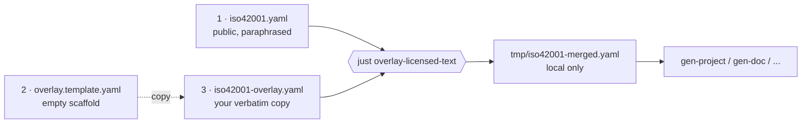

# About iso42001

A [LinkML](https://linkml.io) schema for ISO/IEC 42001:2023 — *Information
technology — Artificial intelligence — Management system* (AIMS).

The schema models the management-system clauses (4–10), Annex A controls, Annex B implementation guidance, Annex C AI objectives and risk sources, and Annex D integration with other management systems. It is intended as a machine-readable companion for AI governance tooling, audit-evidence collection, and integration with adjacent standards such as ISO/IEC 27001.

## Design

### Public schema vs. normative text

The standard itself (ISO/IEC 42001:2023) is © ISO/IEC and may not be
redistributed. To remain freely usable while still being faithful to the
source, the project is split into two layers:

| Layer | File | Distributable | Contents |
|---|---|---|---|
| Public schema | [src/iso42001/schema/iso42001.yaml](../src/iso42001/schema/iso42001.yaml) | Yes (Apache-2.0) | Structure (classes, slots, enums, mappings) plus **paraphrased** descriptions. |
| Verbatim overlay | `src/iso42001/schema/iso42001-overlay.yaml` | **No** — license-holder local copy only | Verbatim normative text from the standard, supplied by the user from their licensed copy. |

The public schema is complete on its own: every clause and every Annex A
control is represented, and downstream artefacts (Pydantic models, JSON
Schema, SHACL, OWL, GraphQL, …) are generated from it via the standard
[linkml-project-copier](https://github.com/linkml/linkml-project-copier)
recipes.

### Schema conventions

- **Naming.** `PascalCase` for classes, `snake_case` for slots, lowercase `snake_case` for enum permissible values.
- **Traceability.** Most classes carry annotations `iso42001_clause:` and/or `annex_a_reference:` pointing back to the source clause. These annotations are part of the public schema and are safe to publish.
- **Mappings.** Where ISO/IEC 42001 reuses concepts from ISO/IEC 27001 or other harmonised management-system standards, the relationship is captured via `exact_mappings:` / `close_mappings:` using CURIEs.
- **Subsets.** The `in_subset:` tag groups elements by clause/annex so that generators can emit focused views (e.g. Annex-A-only documentation).
- **Coverage.** The schema covers clauses 1–10 and all 38 Annex A controls of ISO/IEC 42001:2023.

### The verbatim-text overlay

The overlay mechanism lets a license holder substitute the paraphrased
descriptions with the exact normative wording from their copy of the
standard, without forking the schema. **Three files** are involved:

| # | File | Ships in repo? | Distributable? | Written by | Contents |
|---|------|----------------|----------------|------------|----------|
| 1 | [`iso42001.yaml`](../src/iso42001/schema/iso42001.yaml) | yes | yes (Apache-2.0) | maintainers | Public schema with **paraphrased** descriptions. |
| 2 | [`iso42001-overlay.template.yaml`](../src/iso42001/schema/iso42001-overlay.template.yaml) | yes | yes (Apache-2.0) | generated by `just create-empty-overlay` | **Empty** scaffold: every class/slot/enum with blank `description:` / `comments:` placeholders. No copyrighted text. |
| 3 | `iso42001-overlay.yaml` | **no** — git-ignored | **NO** — local only | **the license holder** | Copy of (2) with placeholders filled in from a licensed copy of ISO/IEC 42001:2023. |

Build artefact (also git-ignored): `tmp/iso42001-merged.yaml` — produced
by `just overlay-licensed-text` from (1) + (3).



**How to populate (3).** Copy (2) to `iso42001-overlay.yaml`, then for
each entry replace the empty `description: ''` with a YAML block scalar
containing the verbatim text of the matching clause from your licensed
copy of the standard. The right clause is identified by the
`iso42001_clause:` (and/or `annex_a_reference:`) annotation on the same
element in the public schema. Use the `comments:` list for citations
(e.g. `'source: ISO/IEC 42001:2023 S. 6.2'`) and Annex B implementation
guidance. Entries left empty fall back to the public paraphrase.

Key properties:

- **Text-only merge.** Restricted to `description`, `comments`, `title`,
  `aliases`, `see_also`, `notes`. Structural fields (`is_a`, `range`,
  `slots`, `annotations`, `*_mappings`, `permissible_values` keys, …)
  are never overwritten, so the overlay cannot change schema semantics.
- **Empty-wins-nothing.** Partially populated overlays are fine — empty
  values are ignored.
- **Distribution guard.** `.gitignore` excludes both
  `iso42001-overlay.yaml` and `tmp/iso42001-merged.yaml` so they cannot
  be committed by accident.

Workflow for a license holder:

```bash
just create-empty-overlay       # (re)generate file 2 from the public schema
cp src/iso42001/schema/iso42001-overlay.template.yaml \
   src/iso42001/schema/iso42001-overlay.yaml          # create file 3
# ...edit iso42001-overlay.yaml: paste verbatim text into each entry...
just overlay-licensed-text          # -> tmp/iso42001-merged.yaml
```

See [OVERLAY.md](../src/iso42001/schema/OVERLAY.md) for the step-by-step
guide with a worked example of a populated entry.

## Examples and test data

Worked examples live under [tests/data/](../tests/data/) and double as the
project's regression suite:

- [tests/data/valid/](../tests/data/valid/) — one well-formed YAML instance
  per concrete class (e.g. `AIManagementSystem-001.yaml`,
  `AIRisk-001.yaml`, `StatementOfApplicability-001.yaml`). Cross-references
  use CURIEs in the `iso42001:` namespace and reflect a small but
  internally consistent worked example of an AIMS.
- [tests/data/invalid/](../tests/data/invalid/) — minimal counter-examples
  that exercise schema constraints (missing required `id` / `name`,
  out-of-range enum values such as `likelihood: probably`, malformed
  dates, wrong list/scalar shape, …). Each file is expected to fail to
  load.
- [tests/test_data.py](../tests/test_data.py) — parametrised pytest runner
  that loads every `valid/*.yaml` with `linkml_runtime.loaders.yaml_loader`
  and asserts every `invalid/*.yaml` raises `ValueError`.

File names follow the convention `<ClassName>-<suffix>.yaml`; the class
name is taken from the prefix before the first `-` and resolved on
`iso42001.datamodel.iso42001`. Run the suite with:

```bash
just test
```

## Cross-framework mappings (SSSOM)

Schema-level mappings to adjacent AI-governance and management-system
frameworks are published as [SSSOM](https://mapping-commons.github.io/sssom/)
TSV files under [src/iso42001/mappings/](../src/iso42001/mappings/). Every
row in these files is also reflected inline on the corresponding class,
slot, enum, or permissible value of the public schema via the LinkML
mapping slots `exact_mappings:`, `close_mappings:`, `related_mappings:`,
`narrow_mappings:`, and `broad_mappings:`.

| Target framework | File | Rows |
|---|---|---|
| ISO/IEC 22989:2022 (AI concepts and terminology) | [iso42001-to-iso22989.sssom.tsv](../src/iso42001/mappings/iso42001-to-iso22989.sssom.tsv) | 3 |
| ISO/IEC 23894:2023 (AI risk management) | [iso42001-to-iso23894.sssom.tsv](../src/iso42001/mappings/iso42001-to-iso23894.sssom.tsv) | 4 |
| ISO/IEC 27001:2022 (Information security management) | [iso42001-to-iso27001.sssom.tsv](../src/iso42001/mappings/iso42001-to-iso27001.sssom.tsv) | 102 |
| ISO/IEC 29100:2024 (Privacy framework) | [iso42001-to-iso29100.sssom.tsv](../src/iso42001/mappings/iso42001-to-iso29100.sssom.tsv) | 24 |
| NIST AI 100-1 (AI Risk Management Framework, core) | [iso42001-to-nist-ai-100-1.sssom.tsv](../src/iso42001/mappings/iso42001-to-nist-ai-100-1.sssom.tsv) | 65 |
| NIST AI RMF ↔ NIST AI 100-1 (umbrella framing) | [iso42001-to-nist-ai-rmf__nist-ai-100-1.sssom.tsv](../src/iso42001/mappings/iso42001-to-nist-ai-rmf__nist-ai-100-1.sssom.tsv) | 65 |
| NIST AI 600-1 (Generative AI profile) | [iso42001-to-nist-ai-rmf__nist-ai-600-1.sssom.tsv](../src/iso42001/mappings/iso42001-to-nist-ai-rmf__nist-ai-600-1.sssom.tsv) | 33 |

Predicates used: `skos:exactMatch`, `skos:closeMatch`,
`skos:relatedMatch`, `skos:narrowMatch`. All rows carry
`mapping_justification: semapv:LLMBasedMatching` and are intended for
human review. A reverse-direction file (`iso27001-to-iso42001.sssom.tsv`)
is published in the companion `iso27001` repository.

## Related projects

- **iso27001** — companion LinkML schema for ISO/IEC 27001:2022 /
  Amd 1:2024. Concepts shared between the two standards (risk treatment,
  Statement of Applicability, management review, …) are linked via
  `exact_mappings:` in both directions.
