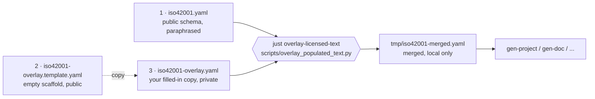

# ISO/IEC 42001:2023 Verbatim-Text Overlay

The public schema [iso42001.yaml](iso42001.yaml) ships with **paraphrased** descriptions only. The normative text of ISO/IEC 42001:2023 is © ISO/IEC and is not reproduced anywhere in this repository.

License holders who own a valid copy of the standard can optionally maintain a **local, private overlay** that swaps the paraphrased descriptions for the exact normative wording, without forking the schema.

## The three files

There are three files involved. Two ship with the repository; one you
create locally and never publish.

| #   | File                                                               | Ships in repo?       | Distributable?      | Who writes it?                       | What it contains                                                                                                                                                                          |
| --- | ------------------------------------------------------------------ | -------------------- | ------------------- | ------------------------------------ | ----------------------------------------------------------------------------------------------------------------------------------------------------------------------------------------- |
| 1   | [`iso42001.yaml`](iso42001.yaml)                                   | yes                  | yes (Apache-2.0)    | maintainers                          | The public schema: structure (classes, slots, enums, mappings) plus **paraphrased** descriptions. Complete and usable on its own.                                                         |
| 2   | [`iso42001-overlay.template.yaml`](iso42001-overlay.template.yaml) | yes                  | yes (Apache-2.0)    | generated by `just create-empty-overlay` | An empty scaffold listing every class, slot, enum, and permissible value with **empty** `description:` and `comments:` placeholders. No copyrighted text. Read-only — never edit by hand. |
| 3   | `iso42001-overlay.yaml`                                            | **no** — git-ignored | **NO** — local only | **you**, the license holder          | A copy of (2) with the empty placeholders filled in from your licensed copy of the standard. Contains verbatim normative text. Never commit, never publish.                               |

A fourth file, `tmp/iso42001-merged.yaml`, is produced when you run
`just overlay-licensed-text`. It is the deep-merge of (1) + (3) and is also
git-ignored. It exists only as a build artefact for your local
generators; do not distribute it.



## Workflow

### Step 1 — generate (or refresh) the empty scaffold

Only needed the first time, or whenever the public schema gains, renames, or removes elements:

```bash
just create-empty-overlay
```

This (re)writes `iso42001-overlay.template.yaml`. It is checked into the
repository so that license holders always have an up-to-date list of
placeholders to fill.

### Step 2 — create your private overlay from the scaffold

One-time, on your own machine:

```bash
cp src/iso42001/schema/iso42001-overlay.template.yaml \
   src/iso42001/schema/iso42001-overlay.yaml
```

The new file `iso42001-overlay.yaml` is git-ignored (see
[.gitignore](../../../.gitignore)) so it cannot accidentally be committed.

### Step 3 — fill in `iso42001-overlay.yaml` from your licensed copy

Open `iso42001-overlay.yaml` in an editor. You will see entries like:

```yaml
classes:
  AIObjective:
    description: ""
    comments: []
  AIPolicy:
    description: ""
    comments: []
```

For each element you want to enrich, replace the empty `description:` with the verbatim normative text of the corresponding clause from **your own licensed copy** of ISO/IEC 42001:2023. To find the right clause, open the matching element in [iso42001.yaml](iso42001.yaml) and look at its `annotations`:

```yaml
classes:
  AIObjective:
    annotations:
      iso42001_clause: "6.2" # main clause to copy text from
      annex_a_reference: "A.6.2" # optional Annex A control reference
```

The populated entry then looks like this (text shown as a placeholder
here so this document remains distributable):

```yaml
classes:
  AIObjective:
    description: |
      <Paste the verbatim text of ISO/IEC 42001:2023 S. 6.2 here,
      preserving its lettered list and trailing bullets.>
    comments:
      - "source: ISO/IEC 42001:2023 S. 6.2"
      - |
        <Optional: paste the verbatim implementation guidance from
        the corresponding Annex B clause (e.g. S. B.6.2) here.>
```

Notes on how to populate:

- **`description:`** — use a block scalar (`|`) for multi-line clauses so the source's bullets and lettered enumerations are preserved verbatim.
- **`comments:`** — a list. Use it to add the clause citation (e.g.
  `'source: ISO/IEC 42001:2023 S. 6.2'`) and any Annex B implementation
  guidance that supplements the main clause. Leave as `[]` if you have
  nothing to add.
- **Skip what you don't need.** Empty `description: ''` or
  `comments: []` entries are ignored at merge time; the public paraphrase is preserved. Populating only the elements you care about is supported.
- **Other text keys.** You may also set `title:`, `aliases:`, `see_also:`, or `notes:` on any element. These are the only keys the merge allows.
- **Slots and enums.** The scaffold also lists every slot and enum
  permissible value under `slots:` and `enums:`. You can fill those in
  the same way; the merge applies to each entry individually.

### Step 4 — apply the overlay to produce a merged schema

```bash
just overlay-licensed-text
```

This runs `scripts/overlay_populated_text.py` and writes `tmp/iso42001-merged.yaml` — the public schema with your overlay text substituted in. Use this merged file as the input to your own internal
`gen-project`, `gen-doc`, or validation tooling. Do not redistribute it.

### Step 5 — re-sync after upstream schema changes

When the public `iso42001.yaml` changes (new classes, renamed slots,
etc.) regenerate the scaffold and diff it against your overlay to spot
new placeholders that need filling:

```bash
just create-empty-overlay
diff -u src/iso42001/schema/iso42001-overlay.template.yaml \
        src/iso42001/schema/iso42001-overlay.yaml | less
```

Add any new empty entries from the template into your overlay and
populate them.

## Merge semantics

`overlay_populated_text.py` performs a deep merge from `iso42001-overlay.yaml`
onto `iso42001.yaml`, restricted to a fixed allow-list of descriptive
keys:

```text
description, comments, title, aliases, see_also, notes
```

Behaviour:

- A non-empty value in the overlay **replaces** the corresponding value in the public schema.
- An empty value (`''`, `[]`, or missing) is ignored; the public paraphrase wins.
- **Structural fields are never overwritten.** `is_a`, `mixins`, `range`,
  `slots`, `slot_usage`, `annotations`, `*_mappings`, `in_subset`, and
  the _keys_ of `permissible_values` (only their inner `description:`
  fields are eligible) all come from the public schema verbatim.
- Permissible-value descriptions inside enums are merged value-by-value
  with the same rules.

This guarantees the overlay can only change human-readable text; it
cannot change the schema's structure or semantics, and therefore cannot
break downstream generators.

## Distribution guard

[`.gitignore`](../../../.gitignore) contains:

```text
/src/iso42001/schema/iso42001-overlay.yaml
/tmp/
```

If you fork this repository, **do not remove those entries**. If you
maintain a private fork that needs the merged schema in CI, use a
private branch or artefact store; never push `iso42001-overlay.yaml` or
`tmp/iso42001-merged.yaml` to a public remote.
